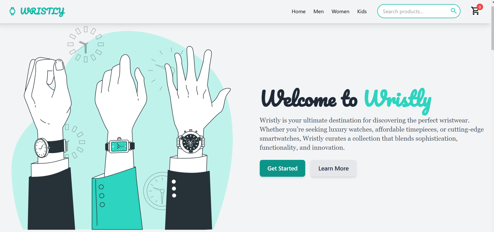
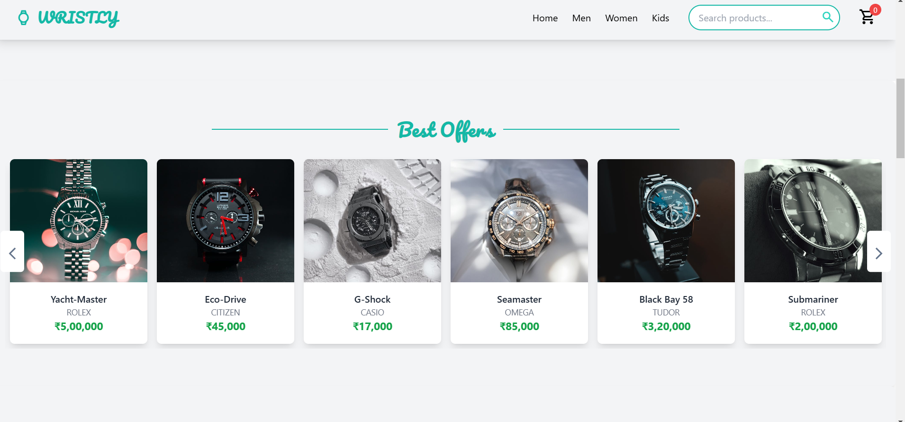
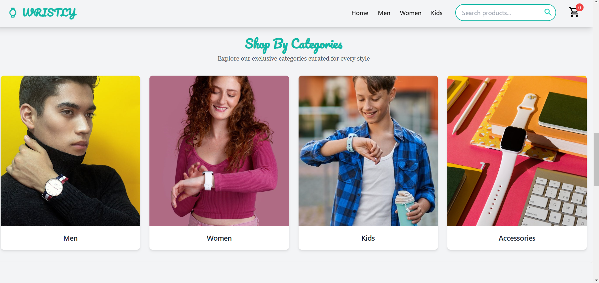
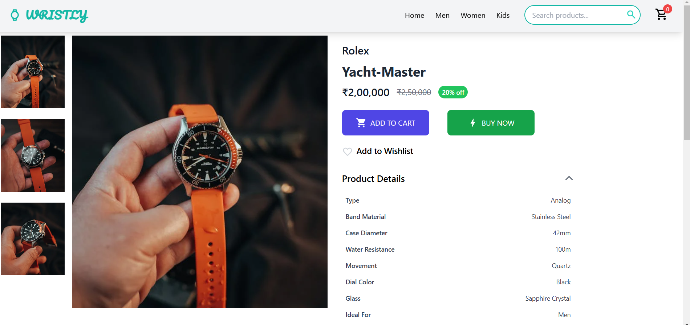
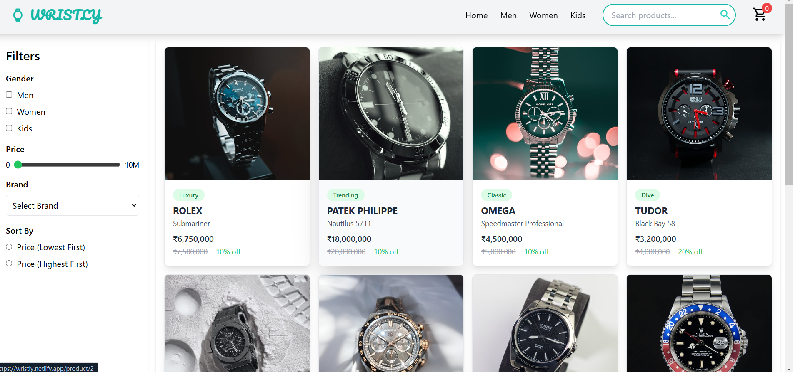
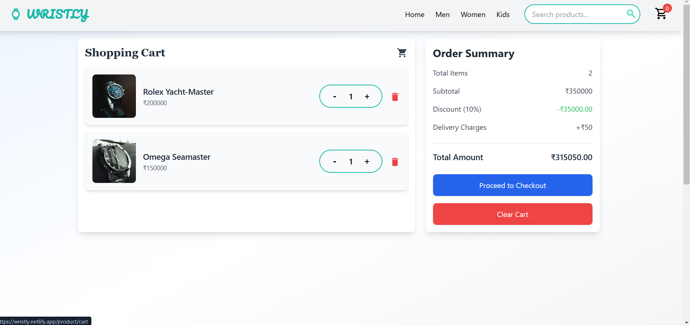

# Wristly

Wristly is a sleek and modern e-commerce frontend application designed for wristwatch enthusiasts. It offers a seamless user experience with visually appealing designs, developed using the latest web technologies.

## Features

- **Home Page**: A captivating landing page showcasing featured products and categories.
- **Categories Page**: Separate pages for Men, Women, and Kids, displaying watches tailored to each category.
- **Single Product Page**: Detailed information about each product, including images, price, and specifications.
- **Cart Page**: A user-friendly shopping cart to manage selected items and view order summaries.

## Tech Stack

- **React**: For building the user interface and handling dynamic interactions.
- **Tailwind CSS**: For styling, ensuring a responsive and modern design.
- **React Slick**: For creating smooth and responsive carousels.
- **React Router Dom**: For Navigating to different pages.

## Deployment

The project is deployed on **Netlify**, ensuring fast and reliable delivery with automatic builds on code changes.

## Installation

To set up the project locally, follow these steps:

1. Clone the repository:
   ```bash
   git clone https://github.com/Ronit1808/wristly.git
   ```
2. Navigate to the project directory:
   ```bash
   cd wristly
   ```
3. Install dependencies:
   ```bash
   npm install
   ```
4. Start the development server:
   ```bash
   npm run dev
   ```
5. Open your browser and visit `http://localhost:5173` to view the application.

## Deployment on Netlify

1. Build the project:
   ```bash
   npm run build
   ```
2. Drag and drop the `dist` folder into Netlify's deployment interface or connect your Git repository for continuous deployment.


## Screenshots
## Home Page


## Carousel


## Categories


## Single Product


## Products


## Cart



## Live Demo
Check out the live project here: [Wristly](https://wristly.netlify.app)

## License

This project is licensed under the MIT License.

---


